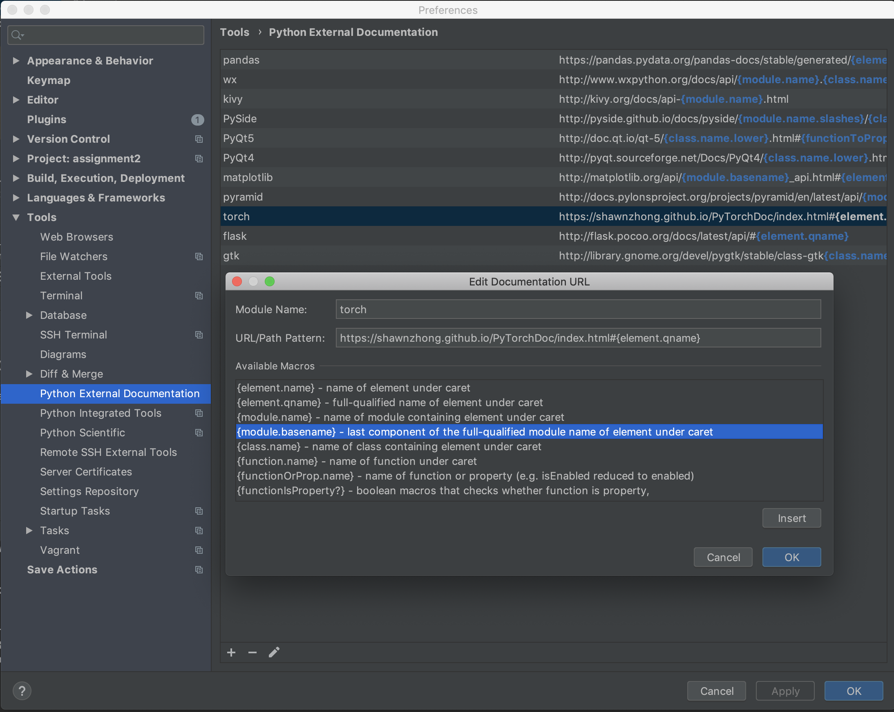
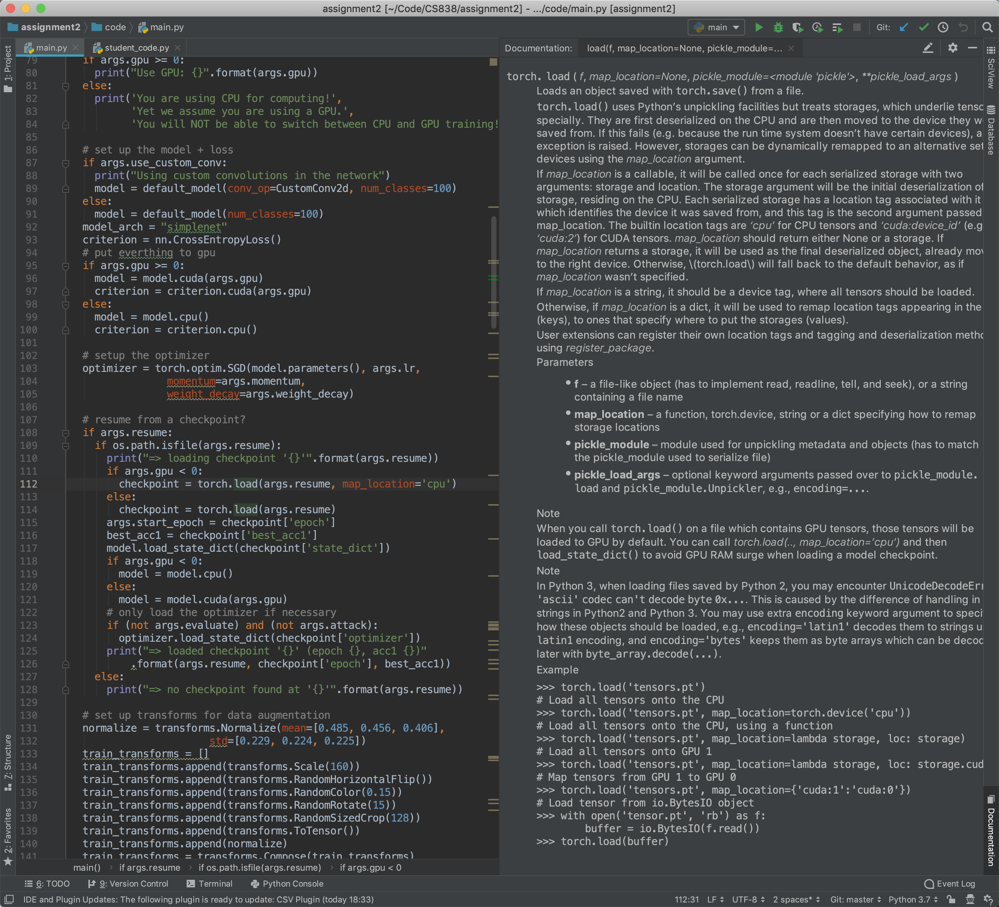

# PyTorch External Documentation for PyCharm

### Setup

Open PyCharm Preferences -> Tools -> Python External Documentation

Add an entry with Module name `torch` and URL `https://shawnzhong.github.io/PyTorchDoc/index.html#{element.qname}`

 ### Useage

You will be able to see the documentation for PyTorch functions when you have the documentation tab open (or with quick documentation on mouse move enabled in the setting) 

